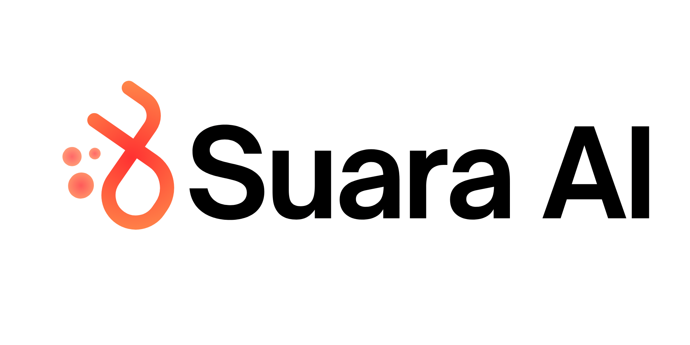

<p align="center">
  <picture>
    <source media="(prefers-color-scheme: dark)" srcset="assets/suaraai-overview_dark.png">
    <source media="(prefers-color-scheme: light)" srcset="assets/suaraai-overview_light.png">
    
  </picture>
</p>

<p align="center">Practice clear English explanations with a realtime speaking copilot.</p>

SuaraAI helps you practice explaining an idea out loud. It gives your thoughts a
simple structure, listens while you speak, offers a useful next sentence when
you get stuck, and gives you a practical review afterwards.

## The problem

Many people understand a topic but struggle to explain it clearly. The hardest
part is often not knowing the subject; it is knowing what to say next, staying
organized, and noticing where the explanation becomes unclear.

Traditional practice gives you either a blank page or a score after the fact.
SuaraAI supports the difficult middle of the practice session: the moment when
you pause, lose your train of thought, or need a better way to continue.

## How SuaraAI helps

1. Enter a topic, notes, or key points.
2. Review a short Talk Map that turns the material into a speaking path.
3. Record yourself while the app shows the live transcript.
4. Receive a contextual rescue hint when you pause or ask for help.
5. Review the recording, conversation timeline, and speaking feedback.
6. Optionally upload a PDF or PPTX and ask questions about your material.

The goal is not to write a perfect script. The goal is to help you keep
speaking, explain ideas in your own words, and learn what to practice next.

## What you can do today

- Prepare a 3–7-part Talk Map from a topic, notes, or key points.
- Reorder the map before recording.
- Use camera and microphone recording directly in the browser.
- See partial and finalized speech as you practice.
- Get local guidance immediately when you are stuck.
- Use optional AI-generated hints when provider keys are configured.
- Review strengths, improvements, useful phrases, and a next practice goal.
- Copy a detailed conversation timeline for review.
- Ask questions about uploaded PDF and PPTX materials.

## Privacy and current boundaries

- No account is required for the current web experience.
- Your video recording stays in the browser as a local recording and is not
  uploaded by SuaraAI.
- Session text, feedback, and indexed document chunks can be stored in
  PostgreSQL when persistence is enabled.
- Speech transcription uses AssemblyAI through a short-lived browser token.
  The long-lived provider key is kept by the backend.
- DeepSeek powers optional Talk Maps, hints, feedback, and material questions.
  Without its key, the core practice flow uses deterministic guidance.
- This is a focused practice tool, not a meeting recorder, account system, or
  long-term media storage service.

## Try it locally

### Lightweight development mode

This mode is useful for working on the interface without running PostgreSQL:

```bash
cp .env.example .env
make install
make dev
```

Open [http://localhost:5173](http://localhost:5173). The frontend talks to the
FastAPI server at [http://localhost:8000](http://localhost:8000).

### Full local stack

This mode runs the frontend, backend, Caddy, and PostgreSQL with pgvector:

```bash
cp .env.example .env
make install
make docker-up
```

Open [http://localhost](http://localhost). See [docs/setup.md](docs/setup.md)
for provider keys, configuration, and troubleshooting.

## Documentation

- [Product brief](docs/product.md) — what SuaraAI is for and what it currently
  supports.
- [Local setup](docs/setup.md) — prerequisites, environment variables, and
  development commands.
- [EC2 deployment](docs/deployment-ec2.md) — deploy the Compose stack to the
  existing EC2 server.
- [Architecture](docs/architecture.md) — system boundaries, data flow, and
  persistence.
- [Realtime behavior](docs/realtime.md) — microphone, transcript, pause, and
  hint behavior.
- [Validation](docs/validation.md) — automated checks and browser acceptance
  scenarios.
- [Frontend notes](apps/frontend/README.md) — frontend-specific commands and
  browser requirements.

## Project status

SuaraAI is currently a web-based hackathon prototype. The product is designed
for short, focused speaking practice with one person at a time. Authentication,
multi-user accounts, server-side video storage, background processing, and
high-availability deployment are outside the current scope.

## License

See [LICENSE](LICENSE).
